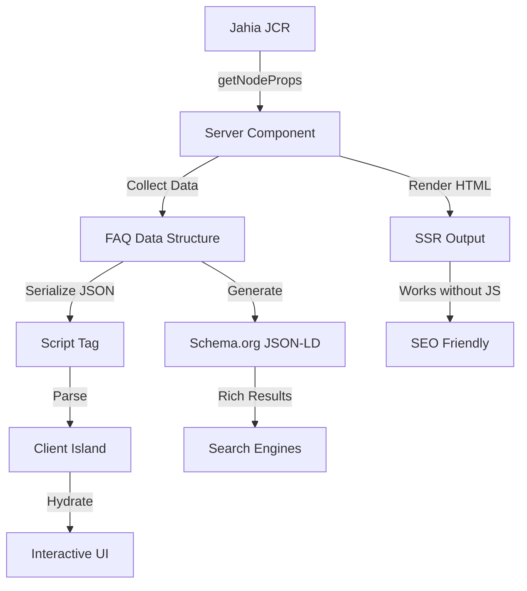

# jsfaq - Jahia FAQ Module

> A modern, SEO-optimized FAQ module for **Jahia 8.2+** built with JavaScript/TypeScript


---

## 📋 Table of Contents

- [Overview](#-overview)
- [Features](#-features)
- [Requirements](#-requirements)
- [Installation](#-installation)
- [Quick Start](#-quick-start)
- [Content Authoring](#-content-authoring)
- [Architecture](#-architecture)
- [Development](#-development)
- [Customization](#-customization)
- [SEO & Schema.org](#-seo--schemaorg)
- [Internationalization](#-internationalization)
- [Accessibility](#-accessibility)
- [Troubleshooting](#-troubleshooting)
- [Contributing](#-contributing)
- [License](#-license)

---

## 🎯 Overview

The **jsfaq** module provides a complete FAQ (Frequently Asked Questions) solution for Jahia CMS. Built with modern web technologies, it combines server-side rendering for optimal SEO with client-side interactivity for enhanced user experience.

### Key Highlights

- ✅ **Server-Side Rendering (SSR)** - Full content rendered server-side, works without JavaScript
- ✅ **Progressive Enhancement** - Interactive features added via client-side hydration
- ✅ **SEO Optimized** - Automatic schema.org JSON-LD structured data generation
- ✅ **Responsive Design** - Mobile-first CSS with modern styling
- ✅ **Multilingual** - Supports EN, FR, DE, ES out of the box
- ✅ **Type Safe** - Built with TypeScript for robust development

---

## ✨ Features

### 🔍 Search & Filtering

- **Real-time Search** - Full-text search across questions and answers
- **Keyword Highlighting** - Search terms automatically highlighted in results
- **Auto-expand on Match** - Matching items automatically open with highlighted keywords
- **Tag Filtering** - Filter questions by Jahia's native tags with visual feedback (optional)

### 🎨 User Experience

- **Collapsible Items** - Click to expand/collapse FAQ items with smooth animations
- **Featured Questions** - Highlight important questions
- **Empty State** - Friendly message when no results found
- **Keyboard Navigation** - Full keyboard support for accessibility

### 🚀 Performance & SEO

- **Schema.org FAQPage** - Automatic structured data for rich search results
- **Server-Side Rendering** - Fast initial page load, SEO-friendly
- **CSS Modules** - Scoped styling with no conflicts (~8KB)
- **Lightweight Client Bundle** - ~8KB (gzipped: ~2.5KB)

### 🛠️ Developer Experience

- **TypeScript** - Full type safety throughout the codebase
- **Hot Reload** - Development mode with instant updates
- **Modern Tooling** - Vite build system, ESLint, Prettier
- **CSS Modules** - Scoped styling with no naming conflicts

---

## 📋 Requirements

| Requirement   | Version               |
| ------------- | --------------------- |
| **Jahia CMS** | 8.2.0.0 or higher     |
| **Node.js**   | 22.0.0 or higher      |
| **Yarn**      | 4.10.3 (via Corepack) |

---

## 🚀 Installation

### For Jahia Administrators

1. **Download** the latest release package (`jsfaq-x.x.x.tgz`)
2. Navigate to **Jahia Administration** → **Server Settings** → **System Components** → **Modules**
3. Click **Upload Module** and select the package file
4. The module will be automatically installed and started

### For Developers

```bash
# Clone the repository
git clone <repository-url>
cd jsfaq

# Install dependencies
yarn install

# Build the module
yarn build

# Package for deployment
yarn package

# Deploy to Jahia (requires .env configuration)
yarn deploy
```

---

## ⚡ Quick Start

### Step 1: Create FAQ Page

1. In **Jahia Edit Mode**, create a new page or navigate to an existing one
2. Add the **FAQ Page** component (`jsfaqnt:faqPage`)
3. Set the **Title** and optional **Introduction** text

### Step 2: Add Content

1. **Option A**: Add **FAQ Sections** for organized content
   - Set Section Title and Description
   - Add FAQ Items inside sections

2. **Option B**: Add **FAQ Items** directly to the page
   - For standalone, uncategorized questions

### Step 3: Configure

- **Featured** - Mark important questions
- **Tags** - Use Jahia's native tag picker for categorization
- **Enable Tag Filter** - Toggle tag filtering on/off (FAQ Page property)

### Step 4: Publish

Your FAQ is now live with:

- ✅ Search functionality
- ✅ Collapsible questions
- ✅ Schema.org structured data
- ✅ Tag filtering (if enabled)

---

## 📝 Content Authoring

### Content Types

| Type                                   | Description        | Parent           |
| -------------------------------------- | ------------------ | ---------------- |
| **FAQ Page** (`jsfaqnt:faqPage`)       | Main FAQ container | Page content     |
| **FAQ Section** (`jsfaqnt:faqSection`) | Optional grouping  | FAQ Page         |
| **FAQ Item** (`jsfaqnt:faqItem`)       | Individual Q&A     | FAQ Page/Section |

### FAQ Page Properties

| Property          | Type      | Required | Description                              |
| ----------------- | --------- | -------- | ---------------------------------------- |
| `jcr:title`       | String    | ✅       | Main page heading                        |
| `intro`           | Rich Text | ❌       | Introduction displayed below title       |
| `enableTagFilter` | Boolean   | ❌       | Show tag filter buttons (default: false) |

### FAQ Section Properties

| Property             | Type      | Required | Description         |
| -------------------- | --------- | -------- | ------------------- |
| `sectionTitle`       | String    | ✅       | Section heading     |
| `sectionDescription` | Rich Text | ❌       | Section description |

### FAQ Item Properties

| Property     | Type      | Required | Description                          |
| ------------ | --------- | -------- | ------------------------------------ |
| `question`   | String    | ✅       | Question text                        |
| `answer`     | Rich Text | ✅       | Answer content (supports HTML)       |
| `isFeatured` | Boolean   | ❌       | Mark as featured (default: false)    |
| `j:tagList`  | Tag[]     | ❌       | Native Jahia tags for categorization |

### Content Structure Example

```
📄 FAQ Page: "Frequently Asked Questions"
│   ├── 📝 Intro: "Find answers to common questions..."
│   └── ⚙️ Enable Tag Filter: true
│
├── 📂 Section: "Getting Started"
│   ├── 💬 Item: "How do I create an account?"
│   │   └── 🏷️ Tags: [account, registration]
│   ├── 💬 Item: "What payment methods are accepted?"
│   │   └── 🏷️ Tags: [payment, billing]
│   └── 💬 Item: "Is there a mobile app?"
│       └── 🏷️ Tags: [mobile, app]
│
├── 📂 Section: "Troubleshooting"
│   ├── 💬 Item: "I forgot my password" ⭐ Featured
│   │   └── 🏷️ Tags: [account, password]
│   └── 💬 Item: "Why can't I log in?"
│       └── 🏷️ Tags: [login, troubleshooting]
│
└── 💬 Standalone Item: "Contact support"
    └── 🏷️ Tags: [support, contact]
```

### Using Tags

The module uses **Jahia's native tagging system** (`jmix:tagged` mixin):

1. **Adding Tags**
   - Edit an FAQ Item in Jahia
   - Use the standard Jahia tag picker
   - Tags are stored in `j:tagList` property

2. **Tag Display**
   - **Filter Buttons** - Appear at top of page when `enableTagFilter` is true
   - **Visual Feedback** - Selected tags show darker styling
   - **Item Badges** - Small badges below each answer when expanded

3. **Tag Filtering**
   - Click tag buttons to filter questions
   - Multiple tags can be selected (AND logic)
   - Filtered items auto-expand with highlighted content

---

## 🏗️ Architecture

### Component Structure

```
jsfaq/
├── 📁 src/
│   ├── 📁 components/
│   │   ├── 📁 FaqPage/
│   │   │   ├── default.server.tsx      # SSR + data collection
│   │   │   ├── FaqPage.client.tsx      # Client Island (hydration)
│   │   │   ├── FaqPage.tsx             # React component
│   │   │   ├── FaqSearch.tsx           # Search bar component
│   │   │   ├── FaqTags.tsx             # Tag filter buttons
│   │   │   ├── EmptyState.tsx          # No results message
│   │   │   └── definition.cnd          # Content type
│   │   ├── 📁 FaqSection/
│   │   │   ├── default.server.tsx
│   │   │   ├── FaqSection.tsx
│   │   │   └── definition.cnd
│   │   └── 📁 FaqItem/
│   │       ├── default.server.tsx
│   │       ├── FaqItem.tsx
│   │       └── definition.cnd
│   ├── 📁 server/
│   │   ├── schemaOrg.ts                # JSON-LD generation
│   │   └── sanitize.ts                 # HTML sanitization
│   ├── 📁 styles/
│   │   └── faq.module.css              # CSS Modules
│   └── types.ts                         # TypeScript types
├── 📁 settings/
│   ├── 📁 locales/                     # Client-side i18n
│   │   ├── en.json
│   │   ├── fr.json
│   │   ├── de.json
│   │   └── es.json
│   ├── 📁 resources/                   # Server-side i18n
│   │   ├── jsfaq.properties            # English
│   │   ├── jsfaq_fr.properties         # French
│   │   ├── jsfaq_de.properties         # German
│   │   └── jsfaq_es.properties         # Spanish
│   └── definitions.cnd                 # Module definitions
└── 📁 dist/                            # Build output
    ├── client/                          # ~8KB (gzipped: ~2.5KB)
    ├── server/                          # ~18KB
    └── assets/                          # ~8KB CSS
```

### Data Flow



### Server-Side Rendering

Each component has a `default.server.tsx` file that:

1. **Retrieves content** from Jahia JCR
2. **Uses `RenderChildren`** helper for nested components
3. **Renders semantic HTML** with proper structure
4. **Serializes data** to JSON for client hydration
5. **Generates schema.org** JSON-LD for SEO

### Client-Side Islands

The `FaqPage.client.tsx` Island component provides:

- ⚡ **Search** with keyword highlighting
- 🎯 **Filtering** by tags
- 📂 **Expand/Collapse** functionality
- ✨ **Visual feedback** for active states
- 🔄 **State management** for user interactions

---

## 💻 Development

### Environment Setup

Create a `.env` file in the project root:

```env
JAHIA_URL=http://localhost:8080
JAHIA_USERNAME=root
JAHIA_PASSWORD=your-password
```

### Available Scripts

| Command        | Description                                  |
| -------------- | -------------------------------------------- |
| `yarn build`   | Build production bundles (TypeScript + Vite) |
| `yarn dev`     | Start development mode with watch            |
| `yarn package` | Create deployment package (.tgz)             |
| `yarn deploy`  | Deploy to Jahia instance                     |
| `yarn lint`    | Run ESLint code quality checks               |
| `yarn format`  | Format code with Prettier                    |
| `yarn clean`   | Remove build artifacts                       |

### Development Workflow

```bash
# Terminal 1: Start watch mode
yarn dev

# Terminal 2: Watch and auto-deploy
yarn watch:callback
```

This setup auto-rebuilds and redeploys on file changes.

### Project Configuration

#### TypeScript (`tsconfig.json`)

```json
{
  "compilerOptions": {
    "target": "ES2020",
    "jsx": "react-jsx",
    "module": "ESNext",
    "moduleResolution": "bundler",
    "strict": true
  }
}
```

#### Vite (`vite.config.mjs`)

```javascript
import { defineConfig } from "vite";
import jahiaVitePlugin from "@jahia/vite-plugin";

export default defineConfig({
  plugins: [jahiaVitePlugin()],
});
```

---

## 🎨 Customization

### Styling

The module uses **CSS Modules** with scoped class names. To customize:

1. Edit `src/styles/faq.module.css`
2. Rebuild: `yarn build`

#### Key CSS Classes

| Class                | Purpose                           |
| -------------------- | --------------------------------- |
| `.jsfaq`             | Main container                    |
| `.jsfaq__header`     | Header section                    |
| `.jsfaq__search`     | Search bar container              |
| `.jsfaq-item`        | Individual FAQ item               |
| `.jsfaq-item--open`  | Opened item state                 |
| `.jsfaq-item__tag`   | Tag badges (0.75rem, 12px radius) |
| `.jsfaq-tag`         | Tag filter buttons                |
| `.jsfaq-tag--active` | Active/selected tag state         |

#### Example Customization

```css
/* Customize colors */
.jsfaq {
  --jsfaq-accent-color: #0066cc;
  --jsfaq-bg-color: #ffffff;
}

/* Customize tag buttons */
.jsfaq-tag {
  background: var(--jsfaq-accent-color);
  color: white;
  border-radius: 20px;
}

/* Customize spacing */
.jsfaq-item {
  margin-bottom: 2rem;
  padding: 1.5rem;
}
```

### Adding Custom Fields

1. **Update Content Type** (`src/components/Faq*/definition.cnd`)

   ```
   - customField (string) i18n
   ```

2. **Update TypeScript Types** (`src/types.ts`)

   ```typescript
   export type FaqItem = {
     // ... existing fields
     customField?: string;
   };
   ```

3. **Update Server Rendering** (`default.server.tsx`)

   ```typescript
   const props = getNodeProps(node, ["customField"]);
   ```

4. **Update Client Component** (if needed)
   ```tsx
   {
     item.customField && <span>{item.customField}</span>;
   }
   ```

---

## 🔍 SEO & Schema.org

### Structured Data

The module automatically generates **FAQPage** structured data:

```json
{
  "@context": "https://schema.org",
  "@type": "FAQPage",
  "mainEntity": [
    {
      "@type": "Question",
      "name": "How do I create an account?",
      "acceptedAnswer": {
        "@type": "Answer",
        "text": "To create an account, click the Sign Up button..."
      }
    }
  ]
}
```

### Benefits

✅ **Rich Snippets** - Expandable Q&A in Google search results  
✅ **Voice Assistants** - Better integration with Alexa, Google Assistant  
✅ **Search Ranking** - Improved visibility for question queries  
✅ **CTR Boost** - Higher click-through rates from search

### Validation

Test your FAQ structured data:

1. Visit your FAQ page
2. Copy the URL
3. Open [Google Rich Results Test](https://search.google.com/test/rich-results)
4. Paste URL and verify FAQPage markup is detected

### SEO Checklist

- ✅ Use descriptive, question-based titles
- ✅ Write comprehensive answers (50-300 words)
- ✅ Include relevant keywords naturally
- ✅ Keep questions concise and clear
- ✅ Use proper heading hierarchy
- ✅ Add internal links in answers

---

## 🌍 Internationalization

### Supported Languages

| Language | Code | Resource Bundle       | Locale File |
| -------- | ---- | --------------------- | ----------- |
| English  | `en` | `jsfaq.properties`    | `en.json`   |
| French   | `fr` | `jsfaq_fr.properties` | `fr.json`   |
| German   | `de` | `jsfaq_de.properties` | `de.json`   |
| Spanish  | `es` | `jsfaq_es.properties` | `es.json`   |

### Adding New Languages

#### 1. Server-side (Jahia Editor)

Create `settings/resources/jsfaq_[locale].properties`:

```properties
# FAQ Page
jsfaqnt_faqPage=FAQ Page
jsfaqnt_faqPage.intro=Introduction
jsfaqnt_faqPage.intro.ui.tooltip=Optional introduction text
# ... more translations
```

#### 2. Client-side (UI Strings)

Create `settings/locales/[locale].json`:

```json
{
  "searchPlaceholder": "Search…",
  "noResults": "No results",
  "clearFilters": "Clear filters",
  "featured": "Featured"
}
```

#### 3. Rebuild

```bash
yarn build
yarn package
yarn deploy
```

---

## ♿ Accessibility

The module follows **WCAG 2.1 Level AA** guidelines:

### Keyboard Navigation

- `Tab` - Navigate between interactive elements
- `Enter`/`Space` - Expand/collapse FAQ items
- `Esc` - Close expanded items (if implemented)

### ARIA Attributes

```html
<button aria-expanded="true" aria-controls="answer-123" aria-labelledby="question-123">
  Question text
</button>
```

### Screen Readers

- ✅ Semantic HTML structure
- ✅ Proper heading hierarchy
- ✅ Descriptive ARIA labels
- ✅ Focus management
- ✅ Skip links support

### Visual

- ✅ Sufficient color contrast (4.5:1 minimum)
- ✅ Focus indicators visible
- ✅ Respects `prefers-reduced-motion`
- ✅ Responsive text sizing

---

## 🐛 Troubleshooting

### Items Don't Collapse

**Symptoms**: FAQ items don't expand/collapse when clicked

**Solutions**:

- Clear browser cache and reload
- Check browser console for JavaScript errors
- Verify client bundle loaded: `/modules/jsfaq/dist/client/components/FaqPage/FaqPage.client.tsx.js`
- Check `data-faq-root` attribute exists on container

### Search Not Working

**Symptoms**: Search input doesn't filter results

**Solutions**:

- Ensure FAQ items contain text content
- Verify `<script type="application/json" data-faq-props>` exists
- Check console for parsing errors
- Confirm `searchPlaceholder` in locale file

### Tag Filters Not Showing

**Symptoms**: No tag filter buttons appear

**Solutions**:

- Verify `enableTagFilter` property is set to `true` on FAQ Page
- Check that at least one FAQ item has tags assigned
- Confirm tags use Jahia's native tag picker (`j:tagList`)
- View HTML source to verify `data-faq-tags` element exists

### Tag Selection Not Visible

**Symptoms**: Can't tell which tags are selected

**Solutions**:

- Check `data-faq-tag-active-class` attribute on FAQ root
- Verify CSS modules are loading (check Network tab)
- Confirm `.jsfaq-tag--active` styles in CSS
- Try hard refresh (Ctrl+Shift+R / Cmd+Shift+R)

### Schema.org Not Detected

**Symptoms**: Google Rich Results Test doesn't find structured data

**Solutions**:

- View page source, find `<script type="application/ld+json">`
- Validate JSON structure (no trailing commas, proper quotes)
- Ensure FAQ items have non-empty answers
- Check that `buildFaqJsonLd()` function executes

### Build Errors

**Symptoms**: `yarn build` fails

**Solutions**:

```bash
# Clear cache and reinstall
yarn clean
rm -rf node_modules
yarn install

# Check Node version
node --version  # Should be 22.0.0+

# Check for TypeScript errors
yarn tsc --noEmit
```

### Deployment Fails

**Symptoms**: `yarn deploy` errors

**Solutions**:

- Verify `.env` file exists with correct credentials
- Check Jahia is running: `curl http://localhost:8080/cms`
- Ensure package exists: `ls dist/package.tgz`
- Check Jahia logs for errors

---

## 🤝 Contributing

Contributions are welcome! Please follow these guidelines:

### Development Process

1. **Fork** the repository
2. **Create** a feature branch: `git checkout -b feature/amazing-feature`
3. **Commit** your changes: `git commit -m 'Add amazing feature'`
4. **Push** to the branch: `git push origin feature/amazing-feature`
5. **Open** a Pull Request

### Code Standards

- ✅ Follow TypeScript best practices
- ✅ Use ESLint and Prettier for formatting
- ✅ Write meaningful commit messages
- ✅ Add tests for new features
- ✅ Update documentation

### Testing Checklist

- [ ] Module builds without errors
- [ ] All FAQ features work (search, collapse, tags)
- [ ] Schema.org validates correctly
- [ ] Accessibility audit passes
- [ ] Works in all supported browsers
- [ ] Responsive design tested

---

## 📄 License

This project is licensed under the **MIT License** - see the [LICENSE](LICENSE) file for details.

---

## 📞 Support

### Resources

- 📚 **Documentation**: [Jahia Academy](https://academy.jahia.com)
- 💬 **Community**: [Jahia Community](https://community.jahia.com)
- 🐛 **Issues**: [GitHub Issues](https://github.com/your-org/jsfaq/issues)
- 📧 **Email**: support@jahia.com

### Getting Help

1. Check the [Troubleshooting](#-troubleshooting) section
2. Search existing [GitHub Issues](https://github.com/your-org/jsfaq/issues)
3. Ask on [Jahia Community](https://community.jahia.com)
4. Create a new issue with detailed information

---

## 🙏 Acknowledgments

- Built with [Jahia JavaScript Modules Library](https://www.npmjs.com/package/@jahia/javascript-modules-library)
- Powered by [Vite](https://vitejs.dev/)
- TypeScript by [Microsoft](https://www.typescriptlang.org/)
- Icons from [Heroicons](https://heroicons.com/)

---

## 📊 Version History

### 0.0.1 (Current)

**Released**: October 2025

**Features**:

- ✅ Server-side rendering with RenderChildren pattern
- ✅ Client-side search with keyword highlighting
- ✅ Collapsible items with smooth animations
- ✅ Schema.org FAQPage structured data
- ✅ CSS Modules styling (~8KB)
- ✅ Multilingual support (EN, FR, DE, ES)
- ✅ Native Jahia tagging with `jmix:tagged` mixin
- ✅ Tag filtering with visual feedback
- ✅ Tag badges inside collapsible answers
- ✅ Configurable tag filter toggle

**Build Output**:

- Client: ~8KB (gzipped: ~2.5KB)
- Server: ~18KB
- CSS: ~8KB

---

**Made with ❤️ for Jahia 8.2+**

[⬆ Back to Top](#jsfaq---jahia-faq-module)
